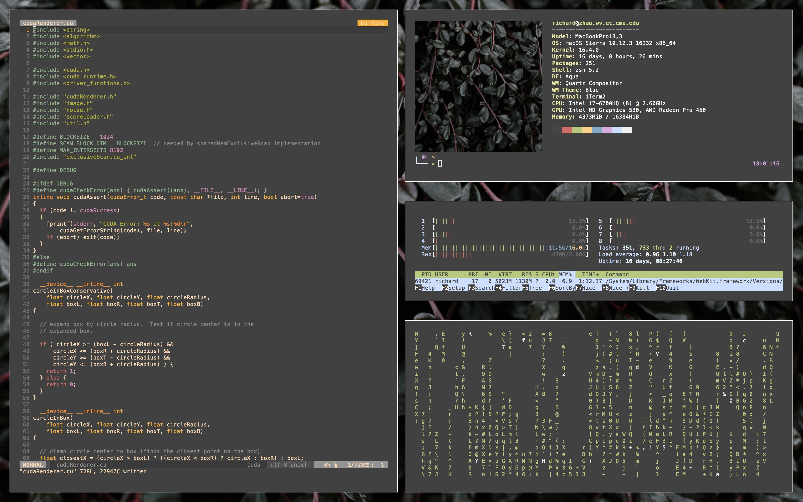
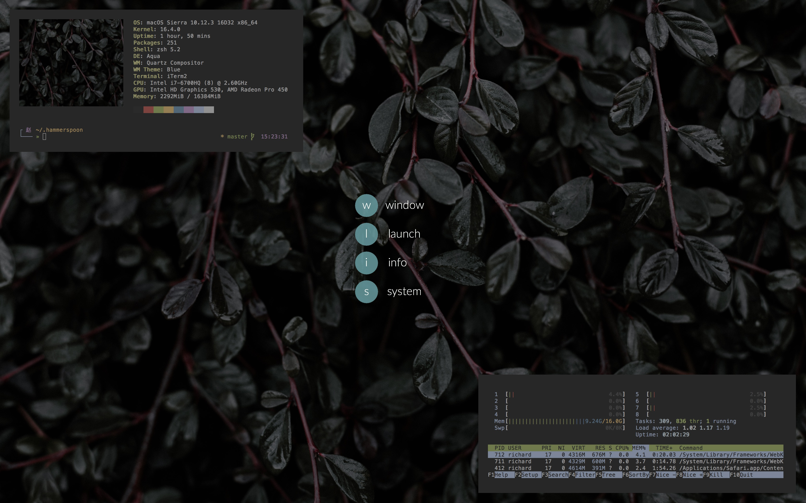

# .dotfiles





A collection of standard configuration files. Easy to move around. No frills
install script.

## Notes

These dotfiles are intended for a macOS system.

`hammerspoon` provides a scripting layer that provides a variety of APIs for
window management, process control, and system configuration. See
`hammerspoon/init.lua` for details. A `hyper` key should be configured using
Karabiner (or similar tools) for full functionality. Hydra style keybindings
are available and are activated using <kbd>hyper</kbd>+<kbd>space</kbd>.

`zsh` is mainly stock, except for a custom theme found in `rz.zsh-theme`. It
uses the `git` plugin and expects powerline fonts.

`emacs` is configured with `evil` mode and `helm` completions with a heavily
customized modeline. `hydra` keybindings use <kbd>space</kbd> as a global
trigger.

`vim` uses `vim-airline` and `gruvbox`.

## Install

```bash
$ cd ~
$ git clone https://github.com/zhaorz/.dotfiles.git .dotfiles

$ cd .dotfiles
$ chmod a+x install.sh
$ ./install.sh
```

All files and directories will be symlinked to your home directory unless
included in `IGNORE` in `install.sh`.
